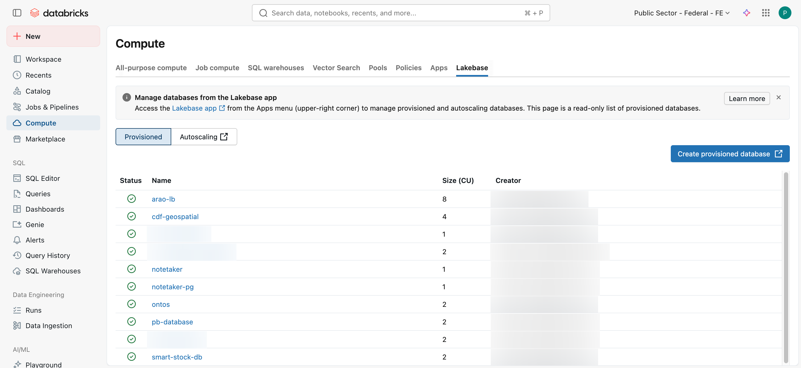
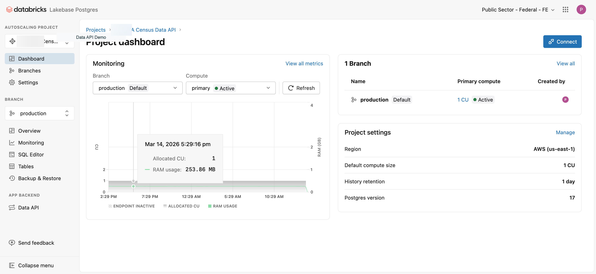
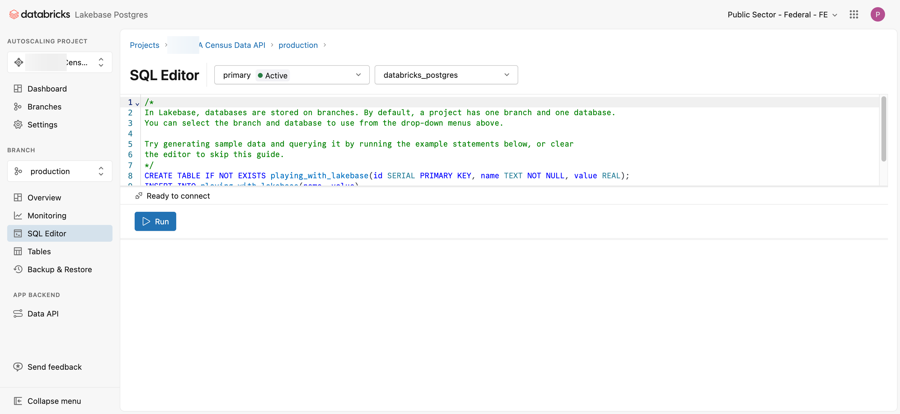
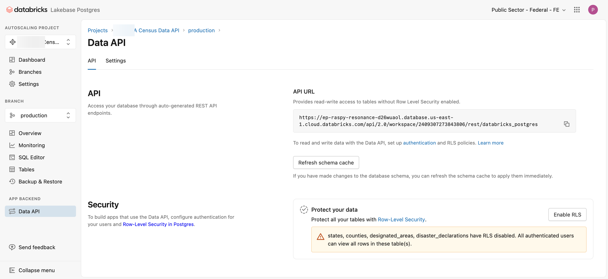
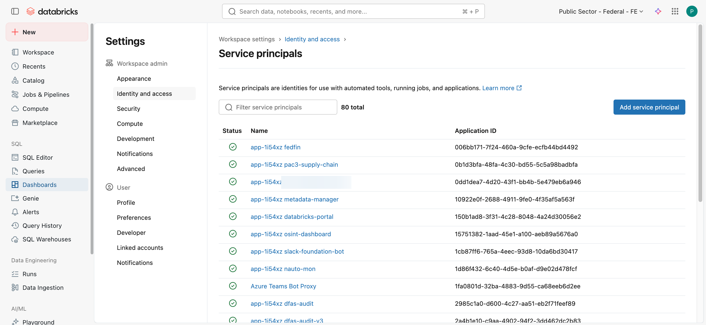
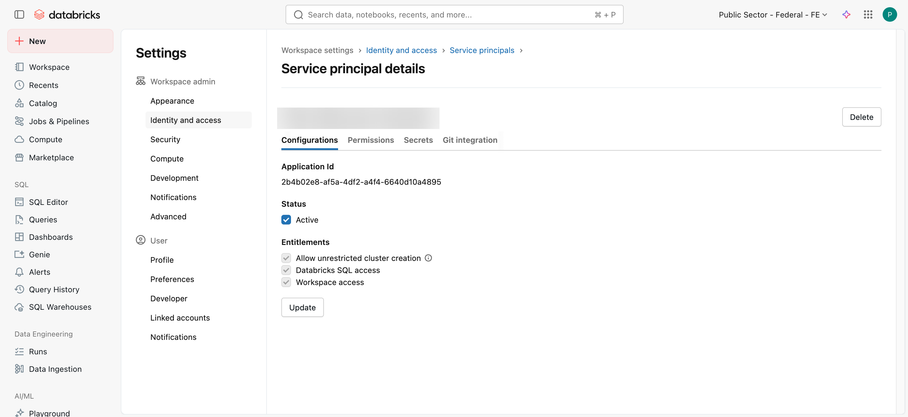
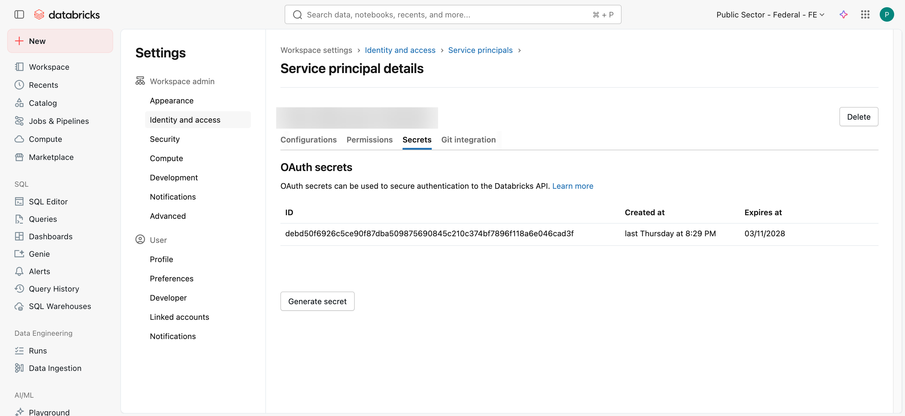

# Databricks Lakebase Data API Guide

**Transform your database tables into production-ready REST APIs — no backend code required.**

<div align="center">


</div>

---

## 📖 What is the Databricks Data API?

The **Databricks Lakebase Data API** automatically exposes your database tables as REST endpoints. Zero backend code, instant API.

```
┌──────────────┐      ┌──────────────┐      ┌──────────────┐
│ Your Tables  │  →   │   Data API   │  →   │  REST HTTP   │
│  (Lakebase)  │      │  (PostgREST) │      │   Clients    │
└──────────────┘      └──────────────┘      └──────────────┘
```

**What you get:**
- ✅ Automatic REST endpoints for every table
- ✅ OAuth 2.0 authentication
- ✅ Filtering, sorting, pagination, and joins built-in
- ✅ Row-level security for fine-grained access control
- ✅ Optional Delta Lake sync for automatic data replication

**Time to API:** 15 minutes

---

## 🎯 Choose Your Path

Pick the approach that fits your use case:

<table>
<tr>
<td width="50%" valign="top">

### 🔵 Path A: Start from Scratch
**Best for:** New projects, small datasets, learning

**You will:**
1. Create a Lakebase project
2. Write SQL to create tables
3. Insert data manually
4. Enable the Data API
5. Configure authentication
6. Test your API

**Time:** 20 minutes

[👉 Go to Path A](#path-a-start-from-scratch)

</td>
<td width="50%" valign="top">

### 🟠 Path B: Sync from Delta Lake
**Best for:** Existing Delta tables, large datasets, production

**You will:**
1. Create a Lakebase project
2. Sync existing Delta table (automatic)
3. Enable the Data API
4. Configure authentication
5. Test your API

**Time:** 15 minutes

**Requires:** Delta table in Unity Catalog

[👉 Go to Path B](#path-b-sync-from-delta-lake)

</td>
</tr>
</table>

---

## Prerequisites

Before starting either path, ensure you have:

- **Databricks workspace access** with permissions to create Lakebase projects
- **Web browser** (Chrome, Firefox, Safari, or Edge)
- **For Path B only:** A Delta table in Unity Catalog with a primary key column

---

# Path A: Start from Scratch

> **Use this path if:** You're starting fresh or want to create tables manually.

## Step 1: Create a Lakebase Project

A **Lakebase project** is a managed PostgreSQL database that auto-scales and integrates with Unity Catalog.

### 1.1 Navigate to Lakebase

1. In Databricks workspace, click **Compute** in the left sidebar
2. Click the **Lakebase Postgres** tab at the top



### 1.2 Create the Project

1. Click **New project**
2. Fill in the form:
   ```
   Project ID:       my-data-api           (lowercase, hyphens only)
   Display Name:     My Data API           (any format)
   PostgreSQL Version: 17                  (recommended)
   ```
3. Click **Create**

⏱️ **Wait time:** ~30 seconds for provisioning (near instant)

### 1.3 Open the Project

Once ready, click the project name to open the dashboard.



---

## Step 2: Create Tables and Load Data

### 2.1 Open the SQL Editor

1. In the project dashboard, find the left sidebar
2. Click **SQL Editor**



### 2.2 Create Your Schema

Copy this example or customize it for your use case:

```sql
-- Example: Products and Categories
CREATE TABLE categories (
    category_id   SERIAL      PRIMARY KEY,
    name          TEXT        NOT NULL UNIQUE,
    description   TEXT,
    created_at    TIMESTAMP   DEFAULT CURRENT_TIMESTAMP
);

CREATE TABLE products (
    product_id    SERIAL         PRIMARY KEY,
    name          TEXT           NOT NULL,
    category_id   INTEGER        REFERENCES categories(category_id),
    price         NUMERIC(10,2)  NOT NULL,
    in_stock      BOOLEAN        DEFAULT TRUE,
    created_at    TIMESTAMP      DEFAULT CURRENT_TIMESTAMP
);

CREATE INDEX idx_products_category ON products(category_id);

-- Insert sample data
INSERT INTO categories (name, description) VALUES
    ('Electronics', 'Computers, phones, and gadgets'),
    ('Furniture', 'Office and home furniture'),
    ('Accessories', 'Peripherals and add-ons');

INSERT INTO products (name, category_id, price, in_stock) VALUES
    ('Laptop Pro', 1, 1299.99, TRUE),
    ('Wireless Mouse', 3, 29.99, TRUE),
    ('Standing Desk', 2, 599.00, TRUE),
    ('USB-C Hub', 3, 49.99, FALSE),
    ('Office Chair', 2, 349.50, TRUE);
```

### 2.3 Run the SQL

1. Select all the SQL (Cmd+A / Ctrl+A)
2. Click **Run** or press `Cmd+Enter` / `Ctrl+Enter`
3. Verify success messages in the output panel

### 2.4 Verify Tables

```sql
-- Check tables exist
SELECT table_name 
FROM information_schema.tables 
WHERE table_schema = 'public';

-- Check data
SELECT * FROM products LIMIT 5;
```

✅ **You're ready to proceed to Step 3**

[👉 Skip to Enable the Data API](#step-3-enable-the-data-api)

---

# Path B: Sync from Delta Lake

> **Use this path if:** You have existing Delta tables in Unity Catalog.

## Step 1: Create a Lakebase Project

### 1.1 Navigate to Lakebase

1. In Databricks workspace, click **Compute** in the left sidebar
2. Click the **Lakebase Postgres** tab at the top


### 1.2 Create the Project

1. Click **New project**
2. Fill in the form:
   ```
   Project ID:       my-data-api           (lowercase, hyphens only)
   Display Name:     My Data API           (any format)
   PostgreSQL Version: 17                  (recommended)
   ```
3. Click **Create**

⏱️ **Wait time:** ~30 seconds for provisioning (near instant)

### 1.3 Open the Project

Once ready, click the project name to open the dashboard.


---

## Step 2: Sync Your Delta Table

### 2.1 Navigate to Your Delta Table

1. Click **Catalog** in the left sidebar
2. Navigate to your catalog → schema → table
   - Example: `my_catalog` → `my_schema` → `products`
3. Click the table name to open its detail page

### 2.2 Create the Synced Table

1. Click the **Create** button in the top-right corner
2. Select **Synced table** from the dropdown

A configuration dialog appears.

### 2.3 Configure the Sync

Fill in the form:

| Field | Value | Notes |
|-------|-------|-------|
| **Target Type** | Lakebase Serverless (Autoscaling) | Only option |
| **Project** | `my-data-api` | Your project from Step 1 |
| **Branch** | `production` | Default branch |
| **Database** | `databricks_postgres` | Default database name |
| **Schema** | `public` | Where tables appear in API |
| **Primary Key** | `product_id` | Choose your unique identifier |

### 2.4 Choose Sync Mode

<table>
<tr>
<th>Mode</th>
<th>How It Works</th>
<th>Best For</th>
</tr>
<tr>
<td><strong>Snapshot</strong></td>
<td>Full table reload on each sync</td>
<td>Infrequent updates, smaller tables</td>
</tr>
<tr>
<td><strong>Triggered</strong></td>
<td>Incremental sync via Change Data Feed</td>
<td>Large tables, frequent updates</td>
</tr>
<tr>
<td><strong>Continuous</strong></td>
<td>Near real-time streaming</td>
<td>Lowest latency requirements</td>
</tr>
</table>

> 💡 **Recommendation:** Start with **Snapshot** for simplicity.

### 2.5 Start the Sync

1. Click **Create**
2. Monitor progress on the table detail page
3. Wait for sync to complete (typically 30-60 seconds for small tables)

### 2.6 Sync Additional Tables (Optional)

Repeat Steps 2.1-2.5 for each Delta table you want to expose via the API.

✅ **You're ready to proceed to Step 3**

---

# Step 3: Enable the Data API

> **Both paths converge here.** Follow these steps regardless of which path you took.

## 3.1 Navigate to the Data API

1. Go to your Lakebase project dashboard
2. In the left sidebar, find **App Backend**
3. Click **Data API**



## 3.2 Enable the API

1. Click **Enable Data API**
2. Wait 10-15 seconds

The API is now active and will:
- Create the `authenticator` role automatically
- Configure the PostgREST schema
- Expose the `public` schema as REST endpoints

## 3.3 Copy Your API URL

After enabling, you'll see your **REST endpoint URL**:

```
https://ep-example-abc123.database.us-east-1.cloud.databricks.com/api/2.0/workspace/123456789/rest/databricks_postgres
```

**Save this URL** — you'll need it for API calls.

### URL Structure

To query a specific table, append `/public/<table_name>`:

```
https://ep-example-abc123.../rest/databricks_postgres/public/products
```

## 3.4 Configure Settings (Recommended)

Click the **Settings** tab and adjust:

| Setting | Value | Why |
|---------|-------|-----|
| **Maximum Rows** | `1000` | Prevent large responses |
| **OpenAPI Specification** | ✅ Enable | Auto-generate client code |
| **Server Timing Headers** | ✅ Enable | Helpful for debugging |
| **CORS Allowed Origins** | `*` (testing)<br>`https://yourdomain.com` (prod) | Control browser access |

Click **Save** after making changes.

> ⚠️ **Note:** The Data API can ONLY be enabled from the UI. There's no CLI or API method.

---

# Step 4: Configure Authentication

Applications access the API using **service principals** (machine identities) with OAuth 2.0.

## 4.1 Create a Service Principal

### Open Service Principal Settings

1. Click your **username** in the top-right corner
2. Select **Settings**
3. Click **Identity and access** → **Service principals**
4. Click **Manage**



### Create the Principal

1. Click **Add service principal**
2. Click **Add new**
3. Enter a name: `my-api-consumer`
4. Click **Add**

## 4.2 Get the Application ID

1. Click the service principal name
2. On the **Configuration** tab, find **Application ID**
3. **Copy the Application ID**



Example: `2b4b02e8-af5a-4df2-a4f4-6640d10a4895`

## 4.3 Generate OAuth Credentials

1. Click the **Secrets** tab



2. Click **Generate secret**
3. Set lifetime (up to 730 days)
4. Click **Generate**
5. **IMMEDIATELY copy both values**:

```
Client ID:      2b4b02e8-af5a-4df2-a4f4-6640d10a4895  (same as Application ID)
Client Secret:  dapi1234567890abcdef...              (shown only once)
```

> ⚠️ **Critical:** The secret is shown ONLY ONCE. Store it securely immediately.

## 4.4 Grant Database Permissions

### Open SQL Editor

Go to your Lakebase project → **SQL Editor**

### Run Grant SQL

Replace `YOUR-APPLICATION-ID` with the Application ID from Step 4.2:

```sql
-- Install auth extension (run once per database)
CREATE EXTENSION IF NOT EXISTS databricks_auth;

-- Create role for service principal
SELECT databricks_create_role('YOUR-APPLICATION-ID', 'SERVICE_PRINCIPAL');

-- Grant to authenticator (required for API access)
GRANT "YOUR-APPLICATION-ID" TO authenticator;

-- Grant schema access
GRANT USAGE ON SCHEMA public TO "YOUR-APPLICATION-ID";

-- Grant read access to all tables
GRANT SELECT ON ALL TABLES IN SCHEMA public TO "YOUR-APPLICATION-ID";

-- Grant sequence access (for auto-increment IDs)
GRANT USAGE ON ALL SEQUENCES IN SCHEMA public TO "YOUR-APPLICATION-ID";
```

### Example with Real Application ID

```sql
CREATE EXTENSION IF NOT EXISTS databricks_auth;

SELECT databricks_create_role('2b4b02e8-af5a-4df2-a4f4-6640d10a4895', 'SERVICE_PRINCIPAL');
GRANT "2b4b02e8-af5a-4df2-a4f4-6640d10a4895" TO authenticator;
GRANT USAGE ON SCHEMA public TO "2b4b02e8-af5a-4df2-a4f4-6640d10a4895";
GRANT SELECT ON ALL TABLES IN SCHEMA public TO "2b4b02e8-af5a-4df2-a4f4-6640d10a4895";
GRANT USAGE ON ALL SEQUENCES IN SCHEMA public TO "2b4b02e8-af5a-4df2-a4f4-6640d10a4895";
```

### Refresh Schema Cache

1. Go to **Data API** page
2. Click **Refresh schema cache**

✅ **Authentication is now configured**

---

# Step 5: Test Your API

## 5.1 Get an OAuth Token

### Using cURL

```bash
export CLIENT_ID="your-client-id-here"
export CLIENT_SECRET="your-client-secret-here"
export WORKSPACE="https://your-workspace.cloud.databricks.com"

export TOKEN=$(curl -s -X POST "${WORKSPACE}/oidc/v1/token" \
  -u "${CLIENT_ID}:${CLIENT_SECRET}" \
  -H "Content-Type: application/x-www-form-urlencoded" \
  -d "grant_type=client_credentials&scope=all-apis" \
  | jq -r '.access_token')

echo "Token: $TOKEN"
```

### Using Python

```python
import requests

CLIENT_ID = "your-client-id-here"
CLIENT_SECRET = "your-client-secret-here"
WORKSPACE = "https://your-workspace.cloud.databricks.com"

response = requests.post(
    f"{WORKSPACE}/oidc/v1/token",
    auth=(CLIENT_ID, CLIENT_SECRET),
    headers={"Content-Type": "application/x-www-form-urlencoded"},
    data="grant_type=client_credentials&scope=all-apis"
)

token = response.json()["access_token"]
print(f"Token: {token}")
```

> 💡 **Tip:** Tokens expire after 60 minutes. Production apps should refresh automatically.

## 5.2 Set Your API URL

```bash
export API_URL="https://ep-example-abc123.../rest/databricks_postgres"
```

## 5.3 Query Your Data

### Get All Records

```bash
curl -s -H "Authorization: Bearer $TOKEN" \
  "$API_URL/public/products" | jq .
```

**Response:**

```json
[
  {
    "product_id": 1,
    "name": "Laptop Pro",
    "category_id": 1,
    "price": "1299.99",
    "in_stock": true,
    "created_at": "2026-04-20T10:30:00"
  },
  {
    "product_id": 2,
    "name": "Wireless Mouse",
    "category_id": 3,
    "price": "29.99",
    "in_stock": true,
    "created_at": "2026-04-20T10:30:00"
  }
]
```

### Filter by Field

```bash
curl -s -H "Authorization: Bearer $TOKEN" \
  "$API_URL/public/products?category_id=eq.1"
```

### Search (Case-Insensitive)

```bash
curl -s -H "Authorization: Bearer $TOKEN" \
  "$API_URL/public/products?name=ilike.*laptop*"
```

### Sort and Paginate

```bash
curl -s -H "Authorization: Bearer $TOKEN" \
  "$API_URL/public/products?order=price.desc&limit=10&offset=0"
```

### Multiple Filters

```bash
curl -s -H "Authorization: Bearer $TOKEN" \
  "$API_URL/public/products?category_id=eq.1&price=gte.500&in_stock=eq.true"
```

### Select Specific Columns

```bash
curl -s -H "Authorization: Bearer $TOKEN" \
  "$API_URL/public/products?select=product_id,name,price"
```

### Join Tables

```bash
curl -s -H "Authorization: Bearer $TOKEN" \
  "$API_URL/public/products?select=name,price,categories(name)"
```

**Response:**

```json
[
  {
    "name": "Laptop Pro",
    "price": "1299.99",
    "categories": {
      "name": "Electronics"
    }
  }
]
```

## 5.4 Python Client Example

```python
import requests

API_URL = "https://ep-example-abc123.../rest/databricks_postgres"
headers = {"Authorization": f"Bearer {token}"}

# Get electronics products over $500
response = requests.get(
    f"{API_URL}/public/products",
    headers=headers,
    params={
        "category_id": "eq.1",
        "price": "gte.500",
        "order": "price.desc"
    }
)

products = response.json()
for product in products:
    print(f"{product['name']}: ${product['price']}")
```

✅ **Your API is now live and ready to use!**

---

# 📚 Query Reference

## URL Structure

```
https://<endpoint>/api/2.0/workspace/<id>/rest/<database>/public/<table>?<parameters>
```

## Filter Operators

| Operator | Meaning | Example |
|----------|---------|---------|
| `eq` | Equals | `?category_id=eq.1` |
| `neq` | Not equal | `?status=neq.active` |
| `gt` | Greater than | `?price=gt.100` |
| `gte` | Greater or equal | `?price=gte.500` |
| `lt` | Less than | `?quantity=lt.10` |
| `lte` | Less or equal | `?rating=lte.3` |
| `like` | Pattern match (case-sensitive) | `?name=like.Laptop*` |
| `ilike` | Pattern match (case-insensitive) | `?name=ilike.*laptop*` |
| `in` | In list | `?category_id=in.(1,2,3)` |
| `is` | Is null/true/false | `?discontinued=is.null` |

## Query Modifiers

| Modifier | Purpose | Example |
|----------|---------|---------|
| `select` | Choose columns | `?select=id,name,price` |
| `order` | Sort (`.asc` or `.desc`) | `?order=price.desc` |
| `limit` | Max rows returned | `?limit=20` |
| `offset` | Skip rows (pagination) | `?offset=40` |

## Common Patterns

**Pagination:**
```
?limit=20&offset=0   # Page 1
?limit=20&offset=20  # Page 2
?limit=20&offset=40  # Page 3
```

**Multiple Filters:**
```
?category_id=eq.1&price=gte.500&in_stock=eq.true
```

**Search + Sort:**
```
?name=ilike.*laptop*&order=price.asc
```

**Select Columns:**
```
?select=product_id,name,price&order=price.desc
```

---

# 🛠 Troubleshooting

## "Principal not found in workspace"

**When:** Creating PostgreSQL role for service principal

**Why:** Service principal created in Account Console but not assigned to workspace

**Fix:**
1. Go to [accounts.cloud.databricks.com](https://accounts.cloud.databricks.com)
2. Click **Workspaces** → Select your workspace → **Permissions** tab
3. Click **Add permissions** → Search for service principal → **Save**
4. Retry in SQL Editor

---

## "Permission denied to grant role"

**When:** Running `GRANT ... TO authenticator`

**Why:** Using project owner account (owner cannot be granted to authenticator)

**Fix:** Create a separate service principal (see Step 4)

---

## "404 Not Found" on New Table

**When:** Querying newly created or synced table

**Why:** Data API schema cache is stale

**Fix:**
1. Go to Data API page
2. Click **Refresh schema cache**
3. Wait 5 seconds
4. Retry query

---

## "401 Unauthorized" / "Token expired"

**When:** API calls fail with 401

**Why:** OAuth tokens expire after 60 minutes

**Fix:** Get a new token (see Step 5.1). Production apps should implement auto-refresh.

---

## "403 Forbidden" for Service Principal

**When:** Service principal authenticates but can't query data

**Why:** PostgreSQL role exists but lacks table permissions

**Fix:**
```sql
GRANT USAGE ON SCHEMA public TO "APPLICATION-ID";
GRANT SELECT ON ALL TABLES IN SCHEMA public TO "APPLICATION-ID";
```

---

## Synced Table Not Appearing

**When:** Created synced table but it's not in SQL Editor

**Why:** Initial sync may still be in progress

**Fix:**
1. Go to Catalog → Table detail page
2. Check sync status
3. Wait for sync to complete
4. Refresh schema cache on Data API page

---

# 📘 Advanced Topics

## Row-Level Security (RLS)

Control which rows users can see based on their identity.

```sql
-- Enable RLS on table
ALTER TABLE products ENABLE ROW LEVEL SECURITY;

-- Create policy: users see only active products
CREATE POLICY active_only ON products
  FOR SELECT
  TO "user@company.com"
  USING (in_stock = true);

-- Service principal with full access
CREATE POLICY full_access ON products
  FOR SELECT
  TO "2b4b02e8-af5a-4df2-a4f4-6640d10a4895"
  USING (true);
```

## Managing Synced Tables

**View sync status:**
1. Go to Catalog → Navigate to your Delta table
2. Check the sync status badge

**Manually trigger sync (Triggered mode):**
1. Table detail page → **Sync** button
2. Or set up a schedule in the sync settings

**Update synced table schema:**
- If Delta table schema changes, the sync automatically detects and updates
- May require a full resync for major changes

**Delete synced table:**
```sql
-- In Lakebase SQL Editor
DROP TABLE your_table_name;
```

> ⚠️ **Note:** Synced tables are READ-ONLY in Lakebase. Modify data in the source Delta table.

---

# 🔗 Reference Links

## Official Documentation

- **[Lakebase Data API](https://docs.databricks.com/aws/en/oltp/projects/data-api)** — Official guide
- **[Lakebase Overview](https://docs.databricks.com/aws/en/oltp/)** — PostgreSQL on Databricks
- **[Synced Tables](https://docs.databricks.com/aws/en/oltp/projects/sync-tables)** — Delta replication
- **[Service Principals](https://docs.databricks.com/aws/en/admin/users-groups/service-principals)** — Identity management
- **[OAuth M2M](https://docs.databricks.com/aws/en/dev-tools/auth/oauth-m2m)** — Machine authentication

## API Syntax

- **[PostgREST Reference](https://postgrest.org/en/stable/references/api.html)** — Complete query syntax

## Tools & SDKs

- **[Python SDK](https://databricks-sdk-py.readthedocs.io/en/latest/workspace/postgres/postgres.html)**
- **[Terraform Provider](https://registry.terraform.io/providers/databricks/databricks/latest/docs/resources/postgres_project)**

---

# ✅ Summary

## What You Accomplished

- ✅ Created a managed PostgreSQL database (Lakebase)
- ✅ Loaded data via SQL **OR** synced from Delta Lake
- ✅ Enabled automatic REST API endpoints
- ✅ Configured secure OAuth authentication
- ✅ Tested API with real queries

## What You Can Do Now

- **Integrate with applications** — Use the API in web, mobile, or backend services
- **Scale automatically** — Lakebase handles compute scaling
- **Sync more tables** — Add additional Delta tables as needed
- **Implement security** — Add row-level security for fine-grained control
- **Monitor usage** — Track API calls and performance in Databricks

---

## 📄 License

Apache 2.0

---

**Need Help?** Refer to [Troubleshooting](#-troubleshooting) or [Reference Links](#-reference-links).
